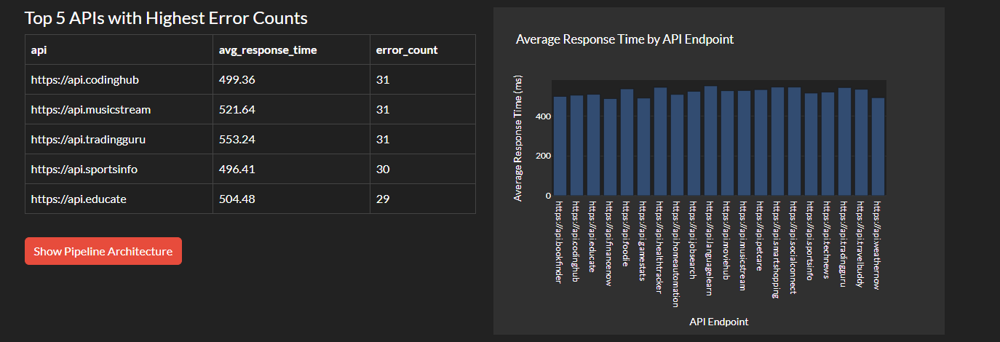

# Log Realtime Analysis

## Overview

Log Realtime Analysis is a robust real-time log aggregation and visualization system designed to handle high-throughput logs using a Kafka-Spark ETL pipeline. For example, it can process application logs tracking user requests, error rates, and API response times in real-time. It integrates with DynamoDB for real-time metrics storage and visualizes key system insights using Python and Dash Library. The setup uses Docker for containerized deployment, ensuring seamless development and deployment workflows.

## Features

- **Log Ingestion:** High-throughput log streaming with Kafka.
- **Real-Time Aggregation:** Spark processes logs per minute for metrics like request counts, error rates, and response times.
- **Metrics Storage:** Aggregated metrics stored in DynamoDB for fast querying. DynamoDB is optimized for low-latency, high-throughput queries, making it ideal for real-time dashboard applications.
- **Data Storage:** Historical logs saved in HDFS as Parquet files for long-term analysis.
- **Interactive Dashboard:** Dash application with real-time updates and SLA metrics visualization.

## Architecture

1. **Input Topic:** `logging_info` for real-time log ingestion.
   - **Purpose:** High-throughput, fault-tolerant log streaming.

2. **Real-Time Aggregation with Spark**
   - **Processing Logic:** Aggregates logs per minute for metrics like request counts, error rates, and response times.
   - **Output Topic:** `agg_logging_info` with structured metrics.

3. **Downstream Processing**
   - **DynamoDB:** Stores real-time metrics for dashboards with low-latency queries.
   - **HDFS:** Stores aggregated logs in Parquet format for long-term analysis.

4. **Visualization with Python Dash**

   - **Purpose:** Auto-refreshing dashboards show live system metrics, request rates, error types, and performance insights.

---

## Dockerized Services

### Zookeeper

- **Image:** `bitnami/zookeeper:latest`
- **Ports:** `2181:2181`
- **Volume:** `${HOST_SHARED_DIR}/zookeeper:/bitnami/zookeeper`

### Kafka

- **Image:** `bitnami/kafka:latest`
- **Ports:** `9092:9092`, `29092:29092`
- **Volume:** `${HOST_SHARED_DIR}/kafka:/bitnami/kafka`

### DynamoDB Local

- **Image:** `amazon/dynamodb-local:latest`
- **Ports:** `8000:8000`
- **Volume:** `${HOST_SHARED_DIR}/dynamodb-local:/data`

### DynamoDB Admin

- **Image:** `aaronshaf/dynamodb-admin`
- **Ports:** `8001:8001`

### Spark Jupyter
- **Image:** `jupyter/all-spark-notebook:python-3.11.6`
- **Ports:** `8888:8888`, `4040:4040`
- **Volume:** `${HOST_SHARED_DIR}/spark-jupyter-data:/home/jovyan/data`

---

## Dashboard

The Python Dash application provides an intuitive interface for monitoring real-time metrics and logs. Key features include:

- SLA gauge visualization.
- Log-level distribution pie chart.
- Average response time by API.
- Top APIs with highest error counts.
- Real-time log-level line graph.

### Dashboard Components

1. **SLA Gauge:** Visualizes the system's SLA percentage.
2. **Log Level Distribution:** Displays the proportion of different log levels.
3. **Average Response Time:** Bar chart showing average response times for APIs.
4. **Top Error-Prone APIs:** Table listing APIs with the highest error counts.
5. **Log Counts Over Time:** Line chart of log counts aggregated by log levels.



---

## How to Run

### Prerequisites
- Docker and Docker Compose installed.
- Shared directory setup for volume bindings.
- Replace `${HOST_SHARED_DIR}` with your host directory.
- Replace `${IP_ADDRESS}` with your host machine IP.

### Steps

1. **Start the Services:**
   ```bash
   docker-compose up -d
   ```
2. **Access Jupyter Notebook:**
   Open `http://localhost:8888` or check the logs for the notebook in Docker for the full URL
3. **Run the Dash App:**
   ```bash
   python ui/ui-prod.py
   ```
   Access the dashboard at `http://127.0.0.1:8050`.
4. **Kafka Setup:**
   - Create topics:
     ```bash
     python kafka/kafka_producer.py
     ```

---

## Data Pipeline

1. **Log Generation:** Logs are streamed to Kafka's `airbnb_system_logs` topic.
2. **Spark Processing:** Spark consumes logs, aggregates them, and produces structured metrics to `agg_airbnb_system_logs`.
3. **Metrics Storage:** Aggregated data is stored in DynamoDB for real-time querying.
4. **Long-Term Storage:** Historical logs are stored in HDFS in Parquet format.

---

## Files

- `docker-compose.yml`: Docker configuration for services.
- `ui/ui-prod.py`: Dash application for visualizing logs and metrics.
- `kafka/kafka_topic.py`: Script for creating Kafka Topics one for granular logs and the other for aggregate logs from spark.
- `kafka/kafka_producer.py`: Script for simulating logs
- `spark/spark-portfolio.ipynb`: Consumes granular logs from the topic `logging_info` and  aggregates the log data by minute intervals, computes statistics (count, avg, max, min response times), and streams the results in JSON format to the Kafka topic`agg_logging_info`
- `spark/spark_kafka.py`: Consumes log messages from a Kafka topic, parses them, and stores aggregated log metrics into a DynamoDB table.


## Future Enhancements

- Integrate machine learning for anomaly detection.
- Add support for multiple regions in DynamoDB.
- Implement alerting (sms and email) for SLA breaches.
- Enhance dashboard for customizable user settings.
---

## License
This project is licensed under the MIT License.
---

## Contributors
- **Ronald Nyasha Kanyepi** - [GitHub](https://github.com/ronaldkanyepi). For any inquiries, please contact [kanyepironald@gmail.com](mailto\:kanyepironald@gmail.com).


